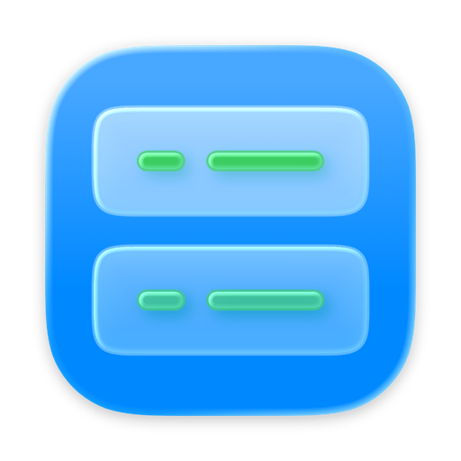
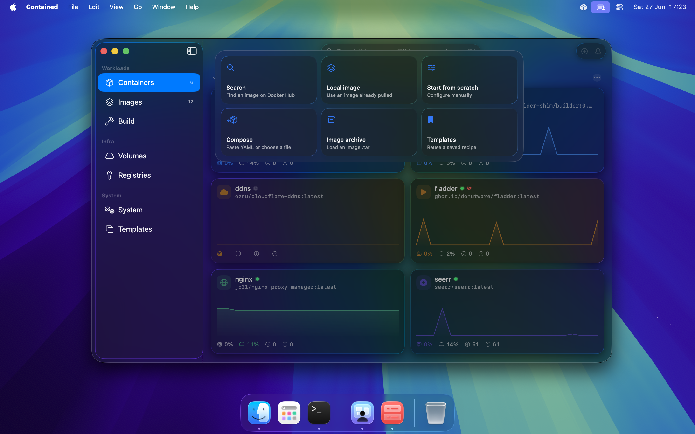

<p align="center">
  
</p>

<h1 align="center">Contained</h1>

Contained is a native macOS control surface for Apple's [`container`](https://github.com/apple/container) CLI. It gives containers, images, volumes, networks, registries, logs, templates, and app-managed health/restart behavior a Mac-first SwiftUI interface without hiding the underlying command line.

<p align="center">
  
  <br><sub><i>Pre-1.0 and actively polishing.</i></sub>
</p>

## What It Does

- Run, edit, stop, restart, inspect, and delete containers.
- Browse rich Liquid Glass cards with local-only tint, icon, nickname, and graph personalization.
- Manage images, tags, updates, archives, volumes, networks, registry credentials, templates, activity history, and system resources.
- Import Compose files into editable run forms instead of launching opaque stacks.
- Reveal the exact `container` CLI command before privileged run/edit operations.
- Optionally enable the floating toolbar, morph panels, command palette, Docker Hub search, image build workspace, keyboard shortcuts, and Compose import from Settings -> Experimental.

## Install

Download the latest `.dmg` from [Releases](https://github.com/tdeverx/contained-app/releases).

Sparkle updates are built in. During pre-1.0 development, fresh installs default to the Nightly channel so they can receive current builds. Stable, Beta, and Nightly can be changed in Settings -> Updates.

Requirements:

- macOS 26 or later on Apple silicon
- Apple's `container` CLI 1.0.0 on `PATH`
- Xcode 26 / Swift 6.2+ for local development

## Build

Contained is a SwiftPM-first app with an Xcode workspace over the package graph.

```sh
open Contained.xcworkspace
swift build
swift test
./scripts/bundle.sh debug
open Contained.app
```

Maintainers use `scripts/release.sh` and `scripts/appcast.sh` for signing, notarization, DMG creation, GitHub release notes, and Sparkle appcasts.

## Documentation

The GitHub wiki is the source of truth for feature and implementation notes.
The maintained wiki pages are mirrored in [`docs/wiki`](docs/wiki) so docs
changes can be reviewed with code changes:

- Start: [Features](https://github.com/tdeverx/contained-app/wiki/Features), [Installation](https://github.com/tdeverx/contained-app/wiki/Installation), [Keyboard Shortcuts](https://github.com/tdeverx/contained-app/wiki/Keyboard-Shortcuts), [Troubleshooting](https://github.com/tdeverx/contained-app/wiki/Troubleshooting)
- Workflows: [Creation Workflow](https://github.com/tdeverx/contained-app/wiki/Creation-Workflow), [Run / Edit Form](https://github.com/tdeverx/contained-app/wiki/Run-Edit-Form), [Compose Import](https://github.com/tdeverx/contained-app/wiki/Compose-Import), [Command Palette](https://github.com/tdeverx/contained-app/wiki/Command-Palette), [Updates](https://github.com/tdeverx/contained-app/wiki/Updates)
- Feature areas: [Containers](https://github.com/tdeverx/contained-app/wiki/Features-Containers), [Images](https://github.com/tdeverx/contained-app/wiki/Features-Images), [Resources](https://github.com/tdeverx/contained-app/wiki/Features-Resources), [System & Settings](https://github.com/tdeverx/contained-app/wiki/System-Settings)
- Maintainers: [Architecture](https://github.com/tdeverx/contained-app/wiki/Architecture), [Runtime Adapters](https://github.com/tdeverx/contained-app/wiki/Runtime-Adapters), [Design System](https://github.com/tdeverx/contained-app/wiki/Design-System), [Release Runbook](https://github.com/tdeverx/contained-app/wiki/Release), [Contributing](https://github.com/tdeverx/contained-app/wiki/Contributing), [Issues and Discussions](https://github.com/tdeverx/contained-app/wiki/Issues-and-Discussions)

## Contributing And Support

Start with the [wiki](https://github.com/tdeverx/contained-app/wiki) and
[Troubleshooting](https://github.com/tdeverx/contained-app/wiki/Troubleshooting).
Use [Discussions Q&A](https://github.com/tdeverx/contained-app/discussions/categories/q-a)
for setup help and questions, and
[open an issue](https://github.com/tdeverx/contained-app/issues/new/choose) for
actionable bugs, crashes, regressions, or tracked feature work.

Please read the [contributing guide](https://github.com/tdeverx/contained-app/wiki/Contributing)
before opening a larger PR. Do not post vulnerabilities publicly; use
[private vulnerability reporting](https://github.com/tdeverx/contained-app/security/advisories/new)
instead.

## Architecture

The root package has the app/core targets and consumes local reusable packages:

- `ContainedCore`: models, Apple `container` argv builders, real `container --format json` decoders, compose parsing, and testable service logic.
- `ContainedRuntime`: shared runtime contracts, descriptors, capabilities, command errors, and command execution primitives.
- `AppleContainerRuntime`: the current Apple `container` adapter. Future Docker-compatible, Podman, Lima-backed, remote, or other runtime engines should be sibling adapter targets.
- `Contained`: SwiftUI app shell, navigation, feature views, stores, history, settings, Sparkle support, app state migration, and app-specific presentation mappings.
- [`Packages/ContainedDesignSystem`](Packages/ContainedDesignSystem/README.md): reusable SwiftUI/AppKit visual primitives, tokens, spacing, material, and micro-chrome shared by the app.
- [`Packages/ContainedNavigation`](Packages/ContainedNavigation/README.md): reusable navigation and layout infrastructure shared by app chrome.

Integration is intentionally CLI-based rather than private-framework based. Personalization and app-managed metadata stay local to Contained so the user's container resources remain clean when used directly from the terminal.

## License

Contained is source-available and free for non-commercial use under the [PolyForm Noncommercial License 1.0.0](LICENSE). The Contained name and branding are reserved; see [NOTICE](NOTICE).
