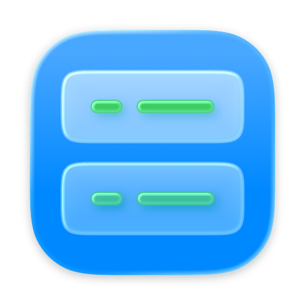
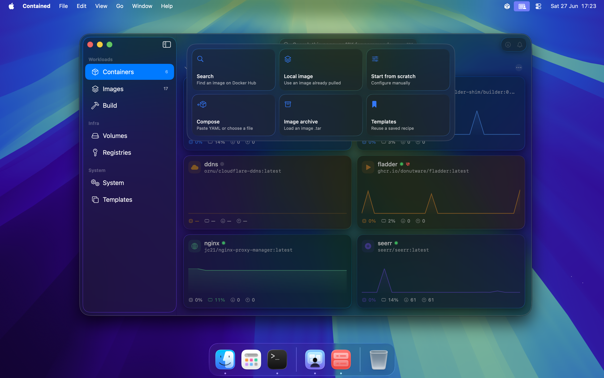

>[!warning]
>Major Refactor in Progress
>
>A large foundation refactor is currently under review in [PR #48](https://github.com/tdeverx/contained-app/pull/48). This introduces significant changes across the codebase and will likely require existing branches to be rebased with manual conflict resolution.
>
>If you’re planning to contribute, it’s recommended that you base new work on this branch until it has been merged.


<p align="center">
  
</p>

<h1 align="center">Contained</h1>

<p align="center">
  A native macOS control surface for Apple's <a href="https://github.com/apple/container"><code>container</code></a> CLI.
</p>

<p align="center">
  
  <br><sub><i>Pre-1.0 and actively polishing.</i></sub>
</p>

## What It Does

Contained gives containers, images, volumes, networks, registries, logs, templates, app-managed health, and restart behavior a Mac-first SwiftUI interface while keeping the underlying command line visible.

- Run, edit, stop, restart, inspect, and delete containers.
- Browse Liquid Glass cards with local-only tint, icon, nickname, and graph personalization.
- Manage images, tags, updates, archives, volumes, networks, registry credentials, templates, activity history, and system resources.
- Import Compose files into editable run forms instead of launching opaque stacks.
- Preview the exact `container` command before privileged run/edit operations.
- Try experimental toolbar panels, morph surfaces, command palette, Docker Hub search, image build workspace, keyboard shortcuts, and Compose import from Settings.

## Install

Download the latest `.dmg` from [Releases](https://github.com/tdeverx/contained-app/releases).

Sparkle updates are built in. During pre-1.0 development, fresh installs default to the Nightly channel so they can receive current builds. Stable, Beta, and Nightly can be changed in Settings -> Updates.

Requirements:

- macOS 26 or later on Apple silicon
- Apple's `container` CLI 1.0.0 on `PATH`
- Xcode 26 / Swift 6.2+ for local development

## Build

Contained has two supported development entry points over the same package graph.

| Path | Use it for |
| --- | --- |
| `Contained.xcworkspace` | Native Xcode build/run, SwiftUI previews, and manual UI iteration |
| `Package.swift` | CI, tests, bundle generation, signing, notarization, release notes, and appcasts |

```sh
open Contained.xcworkspace
swift build
swift test
xcodebuild -workspace Contained.xcworkspace -scheme Contained -configuration Debug build
xcodebuild -workspace Contained.xcworkspace -scheme Contained -configuration Debug test
./Scripts/package.sh app debug
open Contained.app
```

Maintainers use `Scripts/package.sh notarized` and `Scripts/appcast.sh generate` for signing, notarization, DMG creation, GitHub release notes, and Sparkle appcasts.

## Documentation

Start with the [documentation index](Documentation/README.md). The most-used pages are:

- App: [Home](Documentation/App/Home.md), [Installation](Documentation/App/Installation.md), [Keyboard Shortcuts](Documentation/App/Keyboard-Shortcuts.md), [Troubleshooting](Documentation/App/Troubleshooting.md), [Updates](Documentation/App/Updates.md), [System Settings](Documentation/App/System-Settings.md)
- Features: [Feature Overview](Documentation/Features/Features.md), [Containers](Documentation/Features/Containers.md), [Images](Documentation/Features/Images.md), [Resources](Documentation/Features/Resources.md), [Creation Workflow](Documentation/Features/Creation-Workflow.md), [Run / Edit Form](Documentation/Features/Run-Edit-Form.md), [Compose Import](Documentation/Features/Compose-Import.md), [Command Palette](Documentation/Features/Command-Palette.md)
- Architecture: [Architecture](Documentation/Architecture/Architecture.md), [Runtime Adapters](Documentation/Architecture/Runtime-Adapters.md), [Design System](Documentation/Architecture/Design-System.md)
- Development: [Contributing](Documentation/Development/Contributing.md), [Issues and Discussions](Documentation/Development/Issues-and-Discussions.md), [Documentation Map](Documentation/Development/Documentation-Map.md), [Localization](Documentation/App/Localization.md)
- Release: [Release Runbook](Documentation/Release/Release.md)

Package docs live beside each local package:

- [ContainedCore](Packages/ContainedCore/README.md)
- [ContainedUI](Packages/ContainedUI/README.md)
- [ContainedUX](Packages/ContainedUX/README.md)

The checked-in [wiki map](Documentation/Wiki/README.md) explains how maintained docs map to the separate GitHub wiki repository.

## Architecture

The root package contains a tiny SwiftPM launcher and the shared app implementation, then consumes standalone local packages.

| Owner | Responsibility |
| --- | --- |
| [ContainedCore](Packages/ContainedCore/README.md) | Backend orchestration through `Core.*`: runtime descriptors, canonical container models, command previews, Compose import/export, Apple `container` adapter internals, metrics, typed errors, and migration planning |
| [ContainedUI](Packages/ContainedUI/README.md) | Visual system through `UI.*`: tokens, materials, cards, panels, controls, state views, and charts |
| [ContainedUX](Packages/ContainedUX/README.md) | Interaction infrastructure through `UX.*`: safe areas, morphing, source measurement, and panel placement |
| `ContainedApp` | SwiftUI shell, navigation, feature views, stores, history, settings, Sparkle, presentation mapping, localization, and app policy |
| `Contained` | SwiftPM executable launcher used by command-line builds and bundle scripts |

Integration is CLI-based rather than private-framework based. The app talks to `Core.Orchestrator`; Core owns adapter-specific argv and process details. Personalization and app-managed metadata stay local to Contained so the user's container resources remain clean when used directly from the terminal.

Core also exposes a separate `ContainedCoreFixtures` product for deterministic test/preview data under `Core.Fixtures.*`. Normal app and distributable bundle targets do not link it.

## Contributing And Support

Read the [contributing guide](Documentation/Development/Contributing.md) before opening a larger PR.

- Use [Discussions Q&A](https://github.com/tdeverx/contained-app/discussions/categories/q-a) for setup help and questions.
- Use [issues](https://github.com/tdeverx/contained-app/issues/new/choose) for actionable bugs, crashes, regressions, and tracked feature work.
- Use [private vulnerability reporting](https://github.com/tdeverx/contained-app/security/advisories/new) for security issues.

## License

Contained is source-available and free for non-commercial use under the [PolyForm Noncommercial License 1.0.0](LICENSE). The Contained name and branding are reserved; see [NOTICE](NOTICE).
